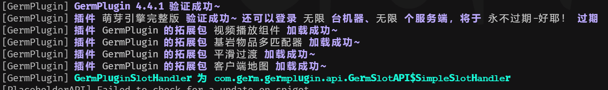
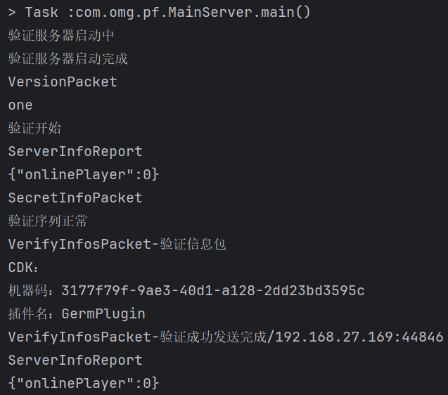

# 萌芽引擎虚拟验证服务器
此项目仅供交流学习验证原理，请勿用于非法用途，可用于二次开发无需授权

## 您为什么会需要此项目
1. 萌芽会偷偷在后台上报服务器人数，侵犯了您的隐私
2. 服务器环境不能连接外网进行验证，需要局域网服务器
3. 您不希望服务器受到萌芽作者的监控
4. 厌恶作者的态度并且不想继续付费

## 效果图

## 兼容版本
理论4.4.1以前都兼容，后续版本只要萌芽引擎不改验证协议都会兼容

## 使用方法
1. 修改host verify.germmc.com为验证服务器地址
2. ``java -jar VirtualGermVerifyServer-1.0-SNAPSHOT.jar``

## 注意事项
1. 验证服务器防火墙注意放行29976 tcp端口